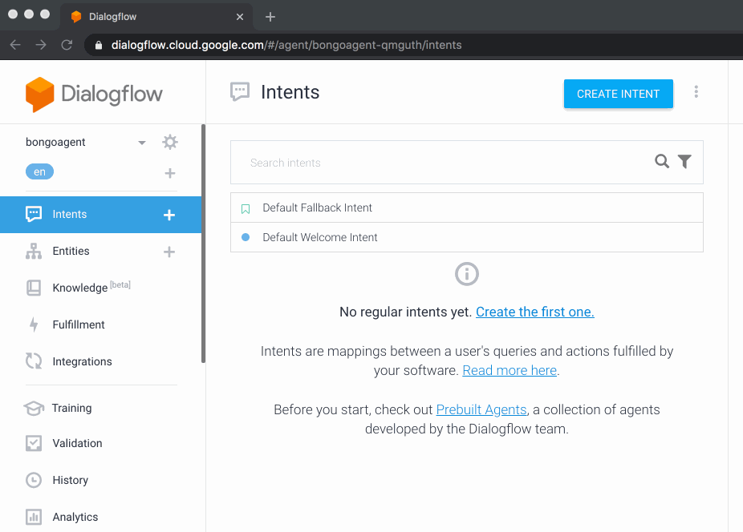

## Agent Config

The **[agent.zip](./agent.zip)** file contains agent setup, training phrases, intents & other configuration included as a convenience

Add the "starter" agent configuration by following these steps:

| Training phrase                     | Descripton                                                            | Code                                            |
| ----------------------------------- | --------------------------------------------------------------------- | ----------------------------------------------- |
| health, healthcheck                 | Will return rich card with chocolate chip cookies if all working well | **[health.ts](./../src/webhook/health.ts)**     |
| I want a large strawberry ice cream | Slot-filling example using ice-cream                                  | **[icecream.ts](./../src/webhook/icecream.ts)** |
| n/a [Welcome]                       | Intent listening for a 'Welcome' event                                | **[welcome.ts](./../src/webhook/welcome.ts)**   |
