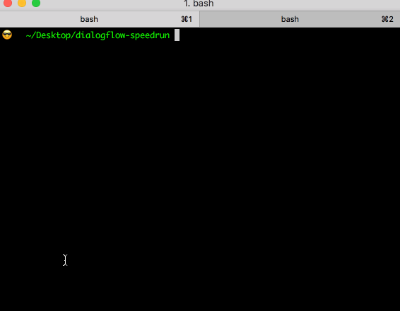
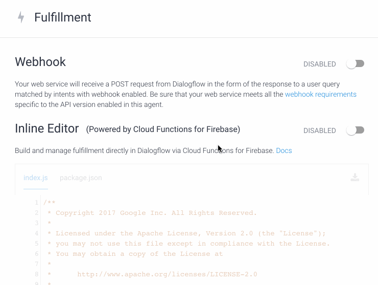
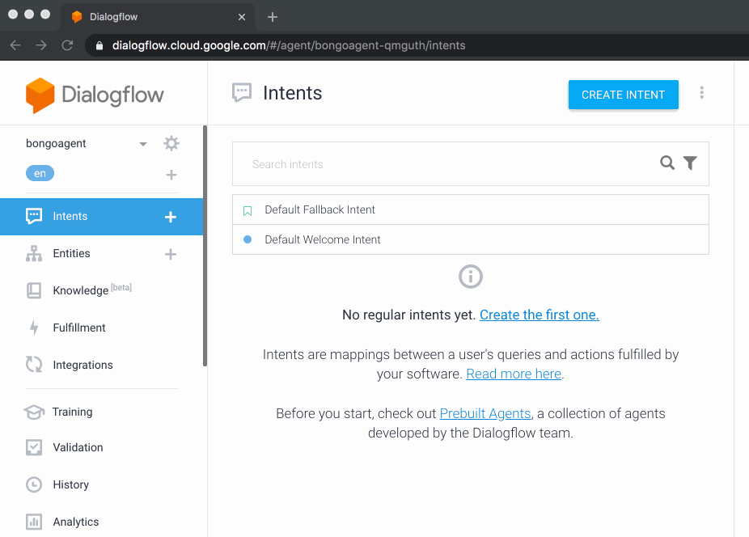
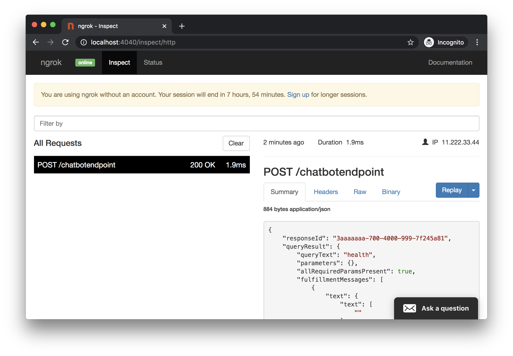

## Quickstart

Note: The steps below assume you have a functioning DialogFlow agent, **[nGrok](#nGrok)** is used for tunneling

## 0. Clone & setup repo

```
git clone https://github.com/valgaze/df-starter-kit
cd df-starter-kit
npm run 1st_time
```

## 1. Get a service-account key

Create & download a **[service account credential](https://dialogflow.com/docs/reference/v2-auth-setup)** and save it as `service-account.json` in the **[settings/ directory](./settings)**

Step by step animated instructions: **[/docs/service_account.md](./docs/service_account.md)**

## 2. Boot server on Port 8000:

```sh
npm run serve
```

## 3. Expose port 8000

In a new terminal enter the following to will open a tunnel using **[nGrok](#nGrok)**

```sh
cd df-starter-kit
npm run tunnel
```



## 4. Add fulfillment URL to DialogFlow

Log in to DialogFlow & copy & paste the URL from step 2 into the **fulfillment** section:



## 5. Add agent config

Find the **[agent.zip file](./agent_config/README.md)** & upload in the settings page and add some starter intents + training to your agent--



## 6. Give it a spin

Check out the frontend on `http://localhost:8000` and try ordering ice cream 3 times

## 5a. Inspect Network Requests

Open **[http://localhost:4040](http://localhost:4040)** to use a traffic inspector from nGrok to see what DialogFlow sends to your webhook (you can also "replay" requests)



## 6. Start improving

If you make an edit to **[health.ts](./src/webhook/health.ts)**, the server will reload automatically and you should be able to see your changes in the simulator. Now that you have most of the basics work with your team & design the best agent you can-- hopefully it can pass the **[Turing test](https://www.dropbox.com/s/y8yw2skwmisbtyi/turing_test.pdf?dl=0)**

- **[see docs](./docs/README.md)**

- **[see glossary](./docs/resources.md)**

## 7. Make it real

See the **[Deployment Instructions](README.md#deployment)** to deploy backend, fulfillment webhook, and a frontend as you need

### nGrok

nGrok will tunnel a port on your machine to a fixed URL controlled by nGrok's system. This is done as a convenience step to get up and running as quickly as possible.

<details><summary>(Expand for details on nGrok)</summary>
<p>

tl;dr: nGrok will expose your port to nGrok's systems so your local install can talk to DialogFlow-- there are password-protection & Pro/paid plans: https://ngrok.com/pricing

nGrok was developed by Alan Shreeve as a way to learn Go. What it does is open a "secure" tunnel to nGrok's system so external services (like DialogFlow's webhook system) can access resources on your local machine as if they were deployed on the public internet. This can make developing fulfillment webhooks insanely convenient & fast when starting out.

While it's really simple/fast to get up and running with a webhook, the downside of this approach is that every time you restart nGrok you will be assigned a new URL which you'll need to update inside DialogFlow's fulfillment settings (paid versions of nGrok have persistent URLs & other features.)

This repo uses an **[npm package](https://www.npmjs.com/package/ngrok)** which instruments on top of nGrok and will append the endpoint specified in **[config.js](../config.js)**

nGrok also comes with a network inspector available on localhost:4040

Using nGrok means you...

- Trust nGrok & the team building systems/servicing for it

- Trust author of nGrok npm package (you can inspect package-lock.json) which downloads an nGrok binary

nGrok is used for convenience only, you can alternatively deploy as a publically-accessible resource, ex like a **[Cloud Function](https://cloud.google.com/functions/docs/writing)**

</p>
</details>
