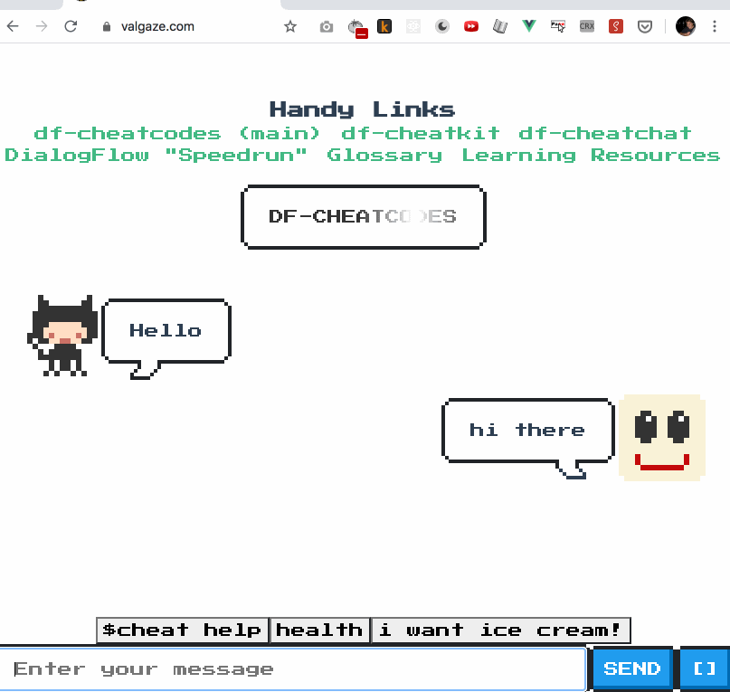

### df-cheatchat

- **Full source + details:** **[https://github.com/valgaze/df-frontend-vue](https://github.com/valgaze/df-frontend-vue)**

- If you don't like Vue, get rid of it, but whatever frontend you create, just have it emit its bundle this **[dist directory](dist/README.md)** so it can be bundle by build tools for hosting

_A fun "retro" DialogFlow frontend interface that can render rich components with many conversational design & debugging tools._

[[WORK IN PROGRESS]]



```
# clone repo & enter directory
cd dist && npm start # or yarn

```

Reference implementation of a conversational interface that renders rich **[components](https://gist.github.com/valgaze/dcd07f6d93f654de6d14d76a341d9450)**

## Libraries & credit

- NES.CSS: https://github.com/nostalgic-css/NES.css

- Press Start 2P font: https://fonts.google.com/specimen/Press+Start+2P

- Carol Skelly's wonderful zero-dependency JSON linter: https://medium.com/wdstack/vue-json-lint-4d665671e993

- Facebook 'shimmer' effect: https://github.com/facebook/Shimmer

- "Shimmer" text effect implemented in CSS: https://codepen.io/redouglas/pen/gobsm

Fun conversational interface for quickly building conversational interfaces

## Other Components

### df-cheatcodes (& df-cheatcodes-base)

- **Details:** **[https://github.com/valgaze/df-cheatcodes](https://github.com/valgaze/df-cheatcodes)**

_Most helpful for "backend"/server stuff, collection of helpers and docs to augment the actions-on-google library. Generally the idea is to make working with rich components, contexts, data, 3rd-party APIs, and other tasks faster & easier_
